# CareMum

A cross-platform maternity care mobile app connecting doctors and patients — built with React Native, Expo, and Firebase.

CareMum streamlines pregnancy care by giving doctors and patients role-based dashboards, real-time appointment management, health tracking, and direct in-app communication, replacing scattered calls and paper records with one connected experience.

## Features

- **Secure Authentication** — user registration, login, and password recovery via Firebase Authentication
- **Role-Based Access Control** — separate, dynamic dashboards for Doctor and Patient user types
- **Appointment Management** — patients can book appointments; doctors can confirm or reject them, with full tracking on both sides
- **Pregnancy Health Tracking** — doctors can monitor pregnancy-week progress; patients can log their own health records
- **Real-Time Chat** — one-to-one messaging between doctors and patients, powered by Firebase Firestore
- **Profile Management** — dedicated profile flows for both Doctor and Patient roles

## Tech Stack

- **Frontend:** React Native, Expo
- **Backend / Database:** Firebase (Authentication, Firestore)
- **Language:** JavaScript

## Database Structure

The app uses Firebase Firestore with the following collections:

- `users` — stores user profiles and role information (Doctor / Patient)
- `appointments` — tracks booking details, status, and doctor-patient links
- `chats` — stores real-time conversation data between doctors and patients
- `healthRecords` — stores patient-entered health data and doctor-tracked pregnancy progress

## Screens

- Splash & Role Selection
- Sign Up / Sign In / Forgot Password
- Doctor Dashboard & Patient Dashboard
- Book Appointment & Appointments (Doctor + Patient views)
- Health Tracker (Doctor + Patient views)
- Chat (Doctor + Patient views)
- Profile & Profile Setup
## Screenshots

### Role Selection
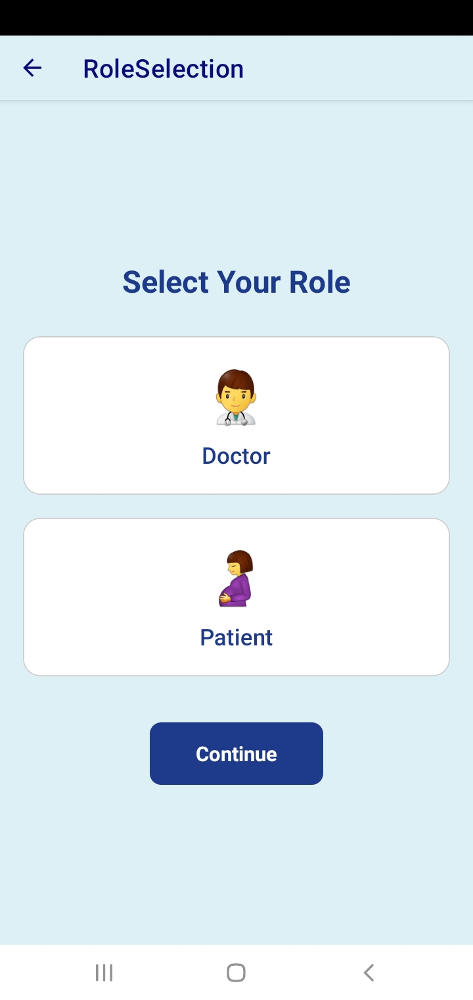
Users choose their role — Doctor or Patient — right after signup, routing them into the correct dashboard experience.

### Login
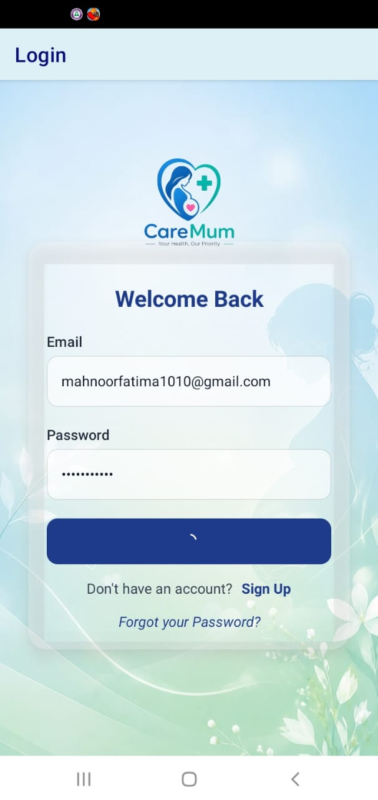
Secure login screen powered by Firebase Authentication.

---

### Doctor Side

**Doctor Dashboard**
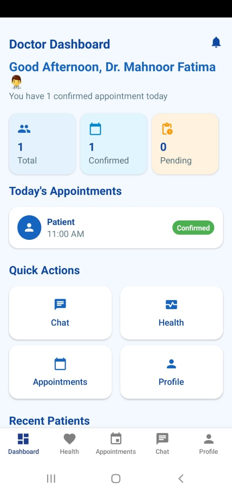
The doctor's home screen, giving quick access to appointments, health tracking, chat, and profile.

**Doctor Profile**
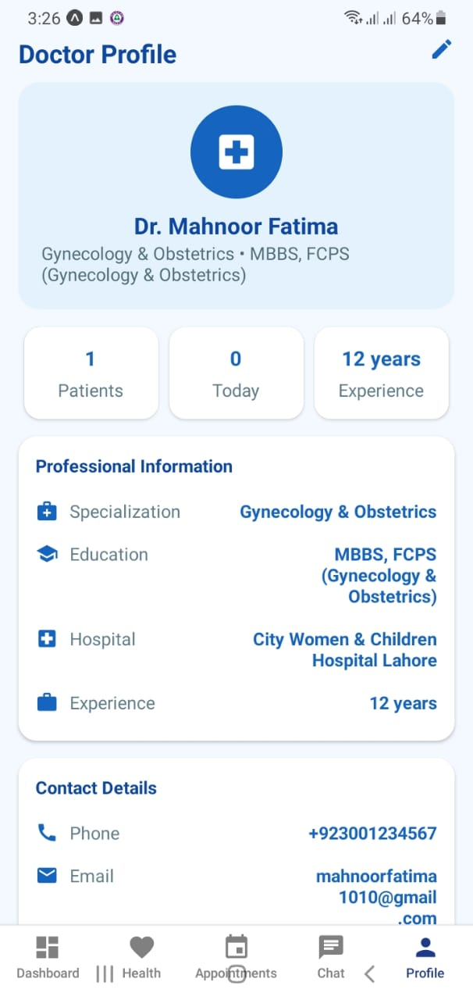
Displays the doctor's professional information, specialization, and contact details.

**Appointments (Doctor View)**
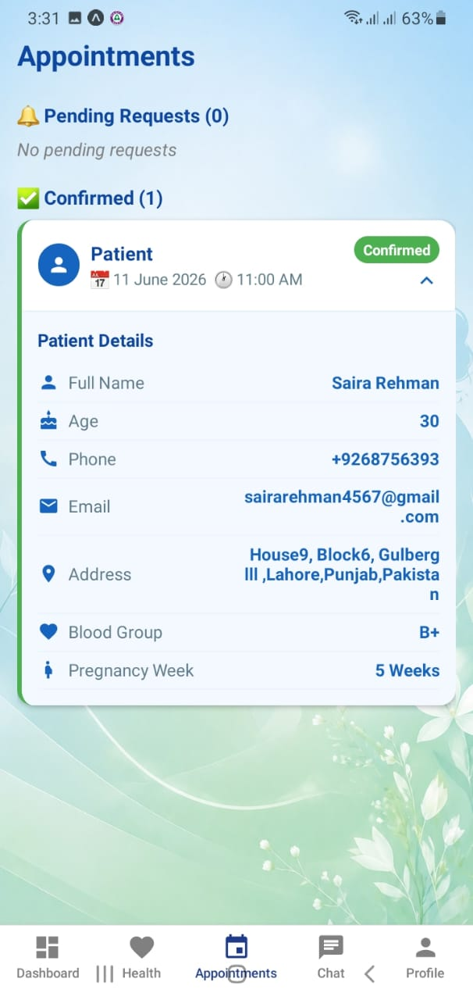
Doctors can view, confirm, or reject incoming appointment requests, with full patient details attached.

**Health Tracker**
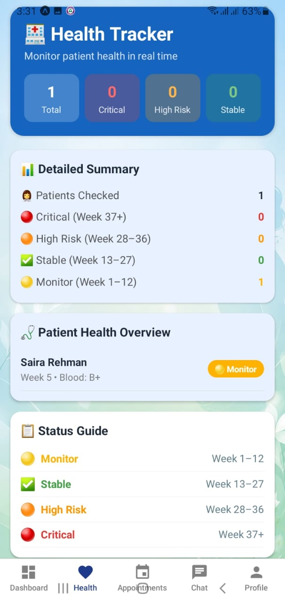
Doctors can monitor all patients' pregnancy progress at a glance, with automatic risk-level categorization (Monitor, Stable, High Risk, Critical).

**Chat**
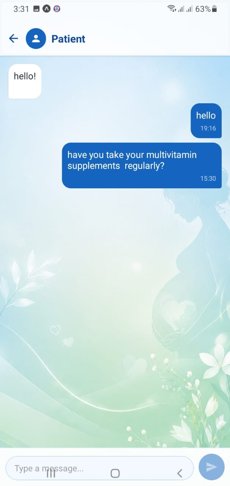
Real-time one-to-one messaging between doctor and patient, powered by Firebase Firestore.

---

### Patient Side

**Patient Dashboard**
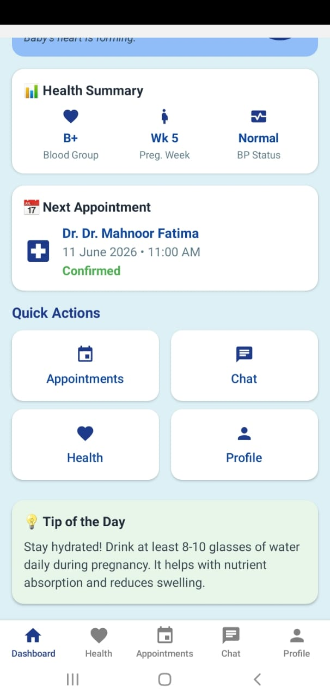
The patient's home screen, showing pregnancy week progress, health summary, and the next upcoming appointment.

**Book Appointment**
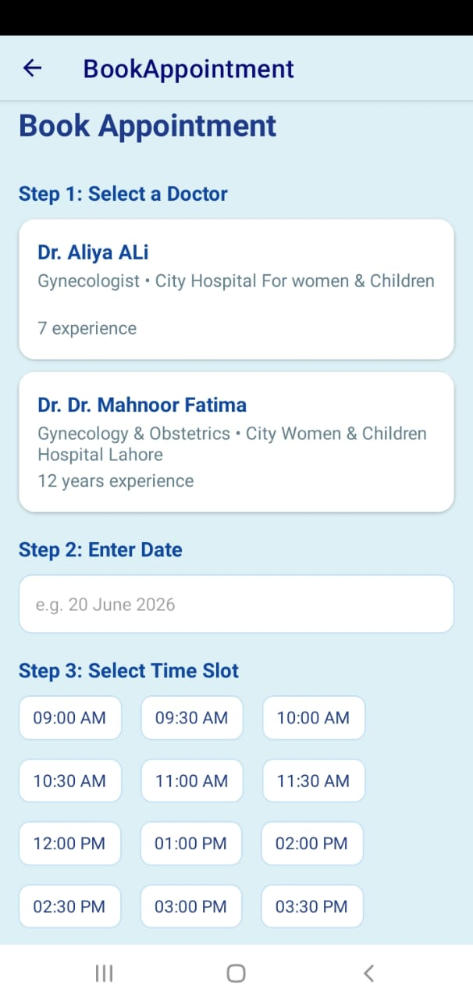
Patients can select a doctor, choose a date, and pick an available time slot to book an appointment.

**My Health**
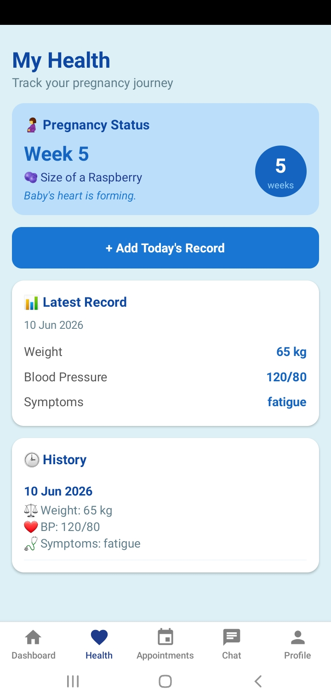
Patients can log daily health records — weight, blood pressure, and symptoms — and track their history over time.

**Patient Profile**
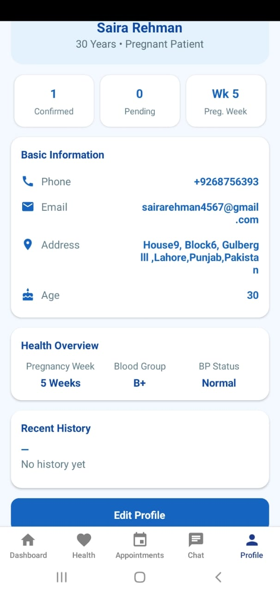
Displays the patient's personal and health information, including pregnancy week, blood group, and BP status.

## Getting Started

This repository contains the application source code. To run it locally, you'll need your own Firebase project and configuration, as the original Firebase credentials are not included in this repository for security reasons.

1. Clone the repository
   ```
   git clone https://github.com/1010rabiaasif-lgtm/CareMum.git
   ```
2. Install dependencies
   ```
   npm install
   ```
3. Add your own Firebase configuration in `Firebase/firebase.config.js`
4. Start the app
   ```
   npx expo start
   ```

## Author

**Rabia Asif**
React Native Developer
[1010rabiaasif@gmail.com](mailto:1010rabiaasif@gmail.com)
